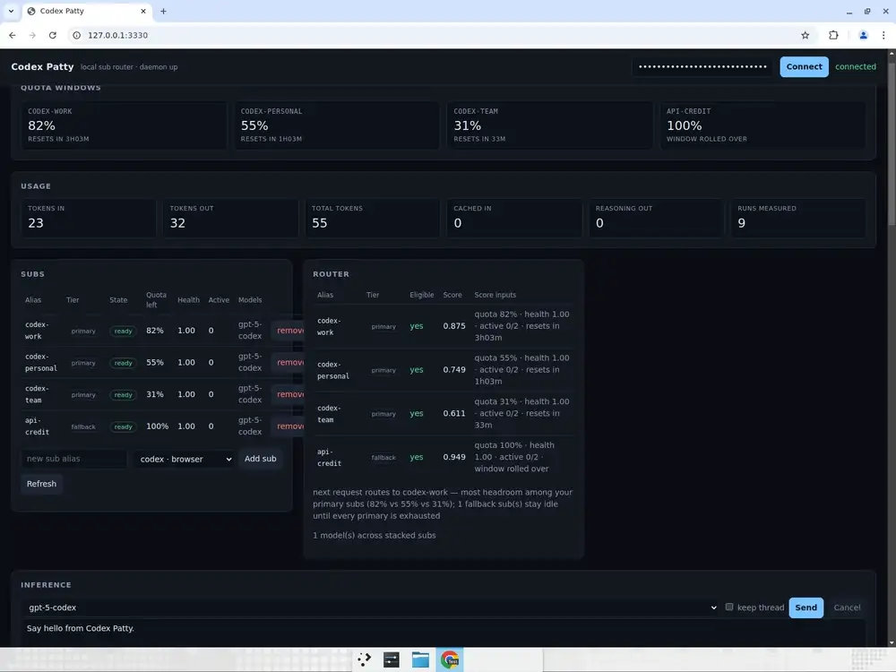
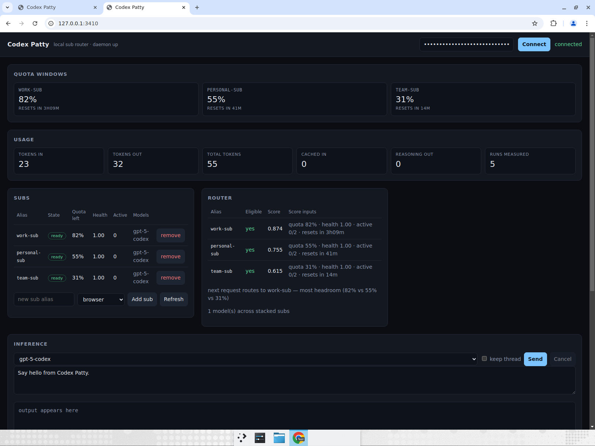

# Pattystack

**Put all your Codex subscriptions in one place, and let your tools use whichever one still has quota left.**

If you pay for more than one ChatGPT/Codex plan, each one sits in its own window with its own limit, and you switch between them by hand. Patty is a small program you run on your own computer that signs into all of them, and hands every request to whichever subscription has the most left. When one runs out, the next one picks it up. You get one address and one password for the whole pile, so anything that already talks to OpenAI — the OpenAI libraries, Cursor, aider, your own app — can use it without changing a line of code.

It also shows you where everything went: how much of each subscription you've used, when each one resets, how many tokens each request cost, and what that would have cost you at OpenAI's normal prices.

Three things it does **not** do: it doesn't run in the cloud (it runs on your machine, and only your machine can reach it), it doesn't touch your passwords or login tokens (the official Codex program handles signing in, exactly as it does today), and it doesn't save your prompts or the answers anywhere.



<sub>Three pretend subscriptions and a spare API key, running for real: how much of each is left, Patty saying which one it picked and why, the answer coming back, and the tokens counted. Run it yourself with `corepack pnpm demo` — no subscription needed.</sub>



## Setup

Copy the block below and give it to your coding agent (Codex, Claude Code, Cursor, aider — anything that can run commands). It will install Patty, check that it works using pretend subscriptions so none of your real ones are touched, and then stop and tell you the two steps only you can do.

````text
Set up @puffle/pattystack (https://github.com/DevelopIQ-ai/codex-patty) on this machine for me.

1. Check `node -v` is >= 22.5 — the store uses `node:sqlite` and older Node fails with
   "No such built-in module: node:sqlite". If it is older, install Node 22 (nvm, volta,
   brew, whatever this machine already uses) and use it for everything below.
2. Start it with three fake subs so nothing real is touched:
       npx @puffle/pattystack --fake=work-sub:0.82:190 --fake=personal-sub:0.55:41 --fake=team-sub:0.31:14
   The daemon prints a one-time `cp_live_…` API key on its first line. Save it — it is
   shown once. It listens on http://127.0.0.1:3210 and nothing else can reach it.
3. Prove it end to end with that key:
       curl -s http://127.0.0.1:3210/v1/models -H "authorization: Bearer $KEY"
       curl -s http://127.0.0.1:3210/v1/chat/completions -H "authorization: Bearer $KEY" \
         -H 'content-type: application/json' \
         -d '{"model":"gpt-5-codex","messages":[{"role":"user","content":"hello"}]}' -i
   Report back the answer and the `x-patty-sub` response header, which names the sub that
   served it. Then open http://127.0.0.1:3210/ and paste the key into the console.
4. Tell me the two env vars to point any OpenAI client at it:
       OPENAI_BASE_URL=http://127.0.0.1:3210/v1
       OPENAI_API_KEY=<the cp_live_… key>
   and create a named key per consumer with `patty keys create <name>`.
5. Then STOP and tell me these two things need me, because you cannot do them:
   - Adding my real subscriptions: each one signs in through a browser window, as me.
     Check the Codex CLI is installed first (`codex --version`); `patty doctor` reports
     whether Patty found it.
   - Keeping it running as a service, if I want that (docs/operations.md), or putting it
     on an always-on box for an app to use (docs/deploy.md).

Rules: do not weaken the loopback default, do not log into any account on my behalf, and
do not put any API key in a file you commit.
````

Prefer to do it yourself? It's two commands. Run `npx @puffle/pattystack --fake=work-sub:0.82 --fake=personal-sub:0.55`, then open <http://127.0.0.1:3210/> and paste in the key it printed. `--fake` makes up subscriptions that behave like real ones — you can watch it choose between them, stream an answer and count tokens without owning a single subscription. That is exactly what the animation above is.

## Use it with real subs

You need the [Codex CLI](https://developers.openai.com/codex) installed, because that is the thing Patty signs in and talks to. If `codex` is on your PATH there is nothing to configure:

```sh
npx @puffle/pattystack
```

If it lives somewhere else, point at it with `PATTY_CODEX_COMMAND=/path/to/codex`. Patty checks the version before it starts a subscription and refuses one it wasn't built against, because that connection changes between Codex releases and a mismatch fails in confusing ways later. `patty doctor` tells you which Codex it found.

Then add each subscription using the **Add sub** box on the web page (or `patty accounts add <name>`), and sign in in the browser window that Codex opens. Repeat for each one. Every subscription keeps its own login in its own private folder, so they stay signed in even if you restart the computer — on start-up Patty reconnects them and tells you which ones came back:

```
{"listening":{"address":"127.0.0.1","port":3210},"restoredSubs":["work-sub","personal-sub"]}
```

## Point any OpenAI app at it

Patty answers in exactly the same shape OpenAI does, so any program that already talks to OpenAI can talk to Patty instead. You change two settings and nothing else:

```sh
export OPENAI_BASE_URL=http://127.0.0.1:3210/v1
export OPENAI_API_KEY=cp_live_...        # a key from `patty keys create puffle-prod`
```

```python
from openai import OpenAI
client = OpenAI()
print(client.chat.completions.create(model="gpt-5-codex",
      messages=[{"role": "user", "content": "hello"}]).choices[0].message.content)
```

Word-by-word streaming (`stream=True`) works the same way it does with OpenAI, and the last chunk tells you how many tokens the request used. Every answer carries a header called `x-patty-sub` naming which subscription actually served it, so you are never guessing.

**Asking for JSON works too.** Most apps do not want a paragraph, they want a filled-in form — a name, a number, a list. Send `response_format` with your JSON schema exactly as you would to OpenAI and the answer comes back in that shape, whichever subscription served it. If you send a schema Patty cannot understand, it tells you instead of quietly answering with prose your code cannot read.

**The rest of your request survives too.** Your system prompt stays the instructions for the turn rather than being glued onto the front of the question, `reasoning_effort` decides how hard the model thinks, and `temperature`, `max_tokens`, `stop` and `seed` are passed on to any subscription that accepts them (a ChatGPT subscription has no such dials, so it ignores them). Send a value that makes no sense and Patty says so rather than guessing.

**Tool calling works too, on your subscriptions.** (Tool calling is how an AI asks your code to run a function — look up the weather, search a database — instead of just replying with text. It is how Cursor and most AI agents work.) Send `tools` exactly as you would to OpenAI: you get back a normal `tool_calls` answer, you run the function, and you send the result back as a normal `tool` message. Behind the scenes Patty hands your functions to the subscription as a tiny local tool server and keeps the half-finished turn waiting for your answer, so the model picks up where it left off instead of starting over.

Not supported yet: asking for several answers at once (`n>1`), logprobs, and images.

## Install and keep it running

```sh
npm i -g @puffle/pattystack     # or just use npx
pattystack              # with no arguments, starts Patty and leaves it running
pattystack usage        # with an argument, runs a command and prints the answer
```

One small package with no other packages inside it contains everything: the program, the command line tool, and the web page. It is meant to stay running in the background, so let your operating system start it for you and restart it if it ever stops:

```ini
# ~/.config/systemd/user/pattystack.service   →  systemctl --user enable --now pattystack
[Service]
ExecStart=%h/.local/share/npm/bin/pattystack
Environment=PATTY_DB_PATH=%h/.patty/patty.sqlite
Restart=on-failure
[Install]
WantedBy=default.target
```

**Only your own computer can reach Patty.** It listens on `127.0.0.1`, an address that never leaves the machine it is running on — not your phone on the same wifi, not anyone on the internet. That is on purpose: your subscriptions are worth money, and an open door would let a stranger spend them. If you do want another machine to reach it, you have to say so out loud with `PATTY_ALLOW_NON_LOOPBACK=1` and name one specific address; "let anyone in" is refused even then. On macOS use a launchd agent instead of the file above. The details are in [docs/operations.md](docs/operations.md).

Want it on a spare machine so an app can use it around the clock? [docs/deploy.md](docs/deploy.md) walks through it. It can't live on Vercel, Trigger.dev or similar, because each subscription is a program that has to stay signed in and running — but apps on those platforms can happily use a Patty running elsewhere.

## What it does

| | |
| --- | --- |
| **Holds all your subscriptions** | As many Codex subscriptions as you like, each kept completely separate from the others, added or removed while it's running. You can also add a normal paid API key (OpenAI, OpenRouter, Together, or a model running on your own machine through Ollama) and it sits alongside them. Patty stores only the *name* of the environment variable your API key lives in — never the key itself — so its database is worthless if someone steals it. |
| **Picks the right one** | For every request it looks at how much each subscription has left, whether it's healthy, how busy it is, and whether it can run the model you asked for. A subscription whose window has already reset counts as full again, and one that's about to reset gets used first, because that leftover quota disappears otherwise. The web page tells you the reason in plain words: "most headroom, 82% vs 55% vs 31%." |
| **Keeps the paid API as a spare tyre** | Your subscriptions are used first, always. A paid API key is only touched when every subscription is out of quota — and traffic goes straight back to your subscriptions the moment one resets. So you keep answering during a dry spell without paying for anything you didn't have to. |
| **Recovers from "you've hit your limit"** | If a subscription refuses a request because it's out of quota, Patty sets it aside until its reset time and quietly retries somewhere else. You see an answer, not an error. |
| **Answers word by word** | Replies stream as they're written, they can be cancelled halfway, and if your browser reconnects it catches up on what it missed. |
| **A separate password per app** | Give each app its own key (`patty keys create puffle-prod`), and you can turn one off without disturbing the others. Usage is counted per key, so you can see what your production app spent versus your laptop. |
| **Stops one app hogging everything** | Set a limit per key — requests per minute, and how many at once. Traffic over the limit **waits its turn** instead of failing, and only requests that still can't be served are turned away. One app having a busy afternoon can't starve the others. |
| **Counts every token** | Tokens in, tokens out, and the cheaper "cached" ones, per request and per subscription — taken from the provider's own numbers, not guessed. |
| **Tells you what it saved you** | Those tokens shown in dollars: what your subscriptions absorbed (what the same work would have cost at OpenAI's list prices) next to what you actually spent on paid API calls. Dollars are the one estimated figure, so a model Patty has no price for is labelled "unpriced" rather than pretending it was free. You can set your own prices. |
| **Keeps a conversation together** | A multi-turn conversation can be pinned to the subscription that started it, so it doesn't lose track of what you were talking about. |
| **A web page and a command line** | A simple page for looking at things; `patty accounts`, `models`, `usage`, `status` and `doctor` for the terminal. |
| **Keeps your content out of it** | Your prompts, the answers, and any tool names or arguments are never written to disk or into the logs. The database holds nicknames, quota numbers, timestamps and token counts — nothing you typed. Patty never reads your login file or moves your tokens around. |

## Layout

```
apps/daemon    router, store, SSE coordinator, Codex app-server adapter, console
apps/cli       patty CLI
packages/contracts        shared types + OpenAPI description
packages/codex-protocol   schemas generated from the official app-server protocol
```

[architecture](docs/architecture.md) explains why it's built this way, [api](docs/api.md) lists every request you can make, [operations](docs/operations.md) covers running it day to day, and [security](docs/security.md) says exactly what is and isn't protected.

## Development

```sh
corepack pnpm lint && corepack pnpm typecheck && corepack pnpm openapi:lint
corepack pnpm test:unit && corepack pnpm test:contract && corepack pnpm test:integration && corepack pnpm test:e2e:fake
```

You need Node 22.5 or newer, because Patty uses the database that's built into Node itself. Most of the tests run against recordings of the real Codex protocol, so they complain loudly the day Patty stops matching it. Only `test:live` needs real subscriptions, and it never runs unless you ask for it.

Issues and pull requests are welcome — read [CONTRIBUTING.md](CONTRIBUTING.md) first. MIT licensed.
